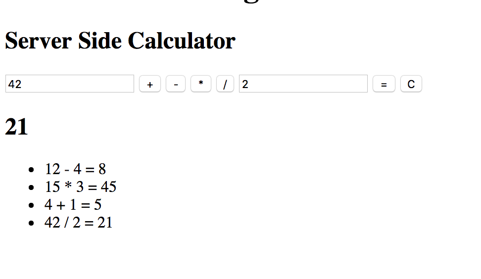

Req:
2 inputs
4 buttons
submit
clear

*** Base Mode ***
client - selectOperator()
called by event listener.
figures out where in the table it is and saves info in global variable.
variable then used by onEquals().

DONE: client - POST - onEquals()
sends object {
- input a
- input b
- operator - get it from DOM, based on what cell in table is clicked (use jQuery)
- answer (blank)
}

DONE client - GET
gets array that includes answer in object
- render()

client - DELETE
- sends a DELETE request

DONE server - app.post
- store input values - push to calculations array
- send back a status 201

DONE server - app.get
- Call up function to perform operation.
- Switch function!
- add result to last calc object in array
- response to client: array

server - app.delete
- 

*** Stretch Mode ***
1
client.js
 - inputs - if empty on submit, alert "fill all inputs", return

2
Clear history when clicking button
- 

## TODO List

[x] create base file
[] public
  [x] html 
    [x] inputs
  [] css
  [] client.js
    x - inputs - if empty on submit, alert "fill all inputs", return
    x - clear inputs on submit
[] server
  [] server.js
    - calculations = [];
  [] functions.js

# Weekend Challenge: Server Side Calculator

Welcome to the weekend challenge!

You are going to be building a server-side calculator. The logic for the calculator **must** be implemented on the server. 

## Required Features

### Calculator

Create a user interface where the user can input two values (2 input elements) and the select type of mathematical operation. When the submit (`=` button) is clicked, capture this input, bundle it up in an object, and send this object to the server via a POST. There should also be a 'C' button that will clear the user input fields.

Build out the server-side logic to compute the numbers as appropriate. The server should be able to handle Addition, Subtraction, Multiplication, and Division. Once the calculation is complete, send back the OK. You should do a GET request after the POST to get the actual calculation.

### History

Keep a historical record of all math operations and solutions on the server. Display a list of all previous calculations on the page when it loads using a GET request. Update the list when a new calculation is made.

> NOTE: History should exist even after refreshing the page. It's expected that the history will go away after restarting the server. We'll talk about long term data storage next week.

---

---

> Note: Do not use eval() to complete this assignment.

## Stretch Goals

- Convert the interface to look and behave like a calculator as shown below.

  *Interfaces that mirror real world objects are often more intuitive and self-explanatory for users.*

---

---

- Only allow the POST call to happen if all necessary input is ready.

  *Data integrity is superfluously important! Sometimes users hit tje "go button" without fully inputting the needed fields. Show an alert if they left something empty and don't send bad or incomplete data to the server.*

- Allow a user to clear the history by clicking on a button. Technically this shouldn't be a GET or a POST. Look into making a DELETE request!

  *GETs are used to, well, get information from the server. POSTs are used to send new info to the server. DELETEs are used for, you guessed it, deleting info already on the server.*

- Allow a user to click on an entry in the History list to re-run that calculation. This should display the answer on the calculator interface like a normal calculation.

  *Anticipating a user's wants and adding the feature in the interface is often a logical progression that ends up in stretch goals for project.*

